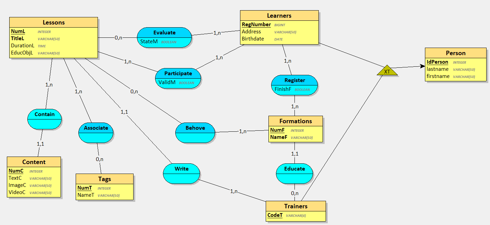
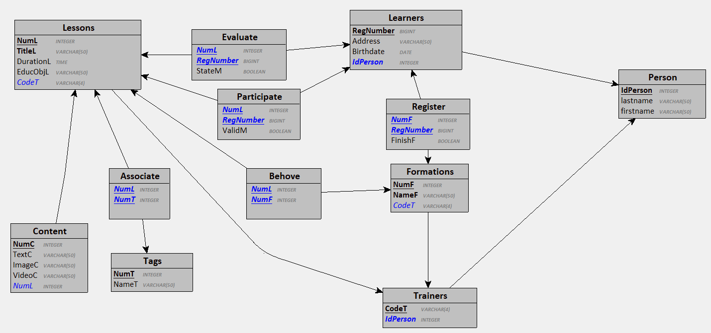

# Conception-BDD-avec-MERISE
  
  > Votre mission est de concevoir la base de données d’une plateforme de formation en ligne nommée pire2pire.com à l'aide de la méthode MERISE.

## Définition acronyme MERISE

  > MERISE signifie "Méthode d'Etude et de Réalisation Informatique par les Sous-Ensembles ou les Systèmes d'Entreprise.

## Règles de gestion

  > Les règles de gestion sont les contraintes d'intégrité de ce que veut l'entreprise pour son application, ces règles doivent être respectées pour faire le MCD.

  > On explique en une phrase comment sont associés deux acteurs(concepts).

  - Un module est caractérisé par un numéro en Sémantique Versionning, un intitulé, un objectif pédagogique, un contenu (un texte et/ou une image et/ou une vidéo),  une durée (heures), un ou plusieurs tags, un auteur (formateur).
  - Une formation est caractérisé par un numéro en Sémantique Versionning, un nom.
  - Un formateur est caractérisé par un code unique (auto-incrément), un nom, un prénom.
  - Un apprenant est caractérisé par un code d'inscription unique (UUID), un nom, un prénom, une adresse, une date de naissance.
  - Une formation est terminé si tous les modules sont validés.
  - Un apprenant peut valider lui-même un ou plusieurs modules.

  1. Un module contient un ou plusieurs contenus et un contenu à un seul module.
  2. Un module contient un ou plusieurs tags et un tag à un plusieurs module.
  3. Un module peut concerner un ou plusieurs formations et une formation à un ou plusieurs module.
  4. Une formation est organisé par un seul formateur et un formateur organise zéro à plusieurs formations.
  5. Un formateur peut être auteur d'un ou plusieurs modules et un module est écris par un seul formateur.
  6. Un apprenant peut s'inscrire à un ou plusieurs formations et une formation à un ou plusieurs apprenants.
  7. Un apprenant peut suivre un ou plusieurs modules et un modules est suivi par un ou plusieurs apprenants.
  8. Un apprenant est évaluer pour un ou plusieurs modules (avec un état de fin de module: OK / KO) et un module est évaluer par zéro ou plusieurs apprenants.

## Dictionnaire de données

  > C'est un tableau qui regroupe toutes les données contenu dans les modèles. Pour chaque donnée on indique son nom, sa signification, son mode (ici M pour Merise) et un exemple.


    |    Nom    | Signification                      | Mode | Exemple                                     |
    |-----------|------------------------------------|------|---------------------------------------------|
    | IdPerson  | Identifiant de la personne         | M    | 25                                          |
    | Lastname  | Nom de la personne                 | M    | Durant                                      |
    | Firstname | Prénom de la personne              | M    | Marie                                       |
    | RegNumber | Numéro d'inscription de l'apprenti | M    | 0242120002                                  |
    | Address   | Adresse de l'apprenti              | M    | 25 rue du pont                              |
    | Birthdate | Date de naissance de l'apprenti    | M    | 25/06/1987                                  |
    | CodeT     | Code du formateur                  | M    | HH                                          |
    | NumF      | Numéro de formation                | M    | 5                                           |
    | NameF     | Nom de la formation                | M    | DevOps                                      |
    | NumM      | Numéro du module                   | M    | 5                                           |
    | TitleM    | Intitulé du module                 | M    | Commandes de base Git                       |
    | DurationM | Durée du module                    | M    | 14                                          |
    | EducObjM  | Objectif pédagogique du module     | M    | Comprendre Git                              |
    | NumC      | Numéro du contenu                  | M    | 1                                           |
    | TextC     | Texte du contenu                   | M    | Initiation à Git                            |
    | ImageC    | Image du contenu                   | M    | LogoGithub.png                              |
    | VideoC    | Video du contenu                   | M    | https://www.youtube.com/watch?v=WxMFZncm12s |
    | NumT      | Numéro du tag                      | M    | 6                                           |
    | NameT     | Nom du tag                         | M    | Github                                      |
    | StateM    | Etat de fin de module              | M    | False                                       |
    | ValidM    | Validation du module               | M    | True                                        |
    | FinishF   | Formation considéré terminer       | M    | True                                        |

  
## MCD (Modèle de Conception de Données)

  > C'est une vue d'ensemble du projet, il reprend toutes les données d'un système d'information. 
  
  > Il permet une communication entre les services techniques et non techniques d'une entreprise.

  > On se sert du dictionnaire de données ainsi que des règles de gestion afin de le crée. 

  


## MLD (Modèle Logique de Données)

  >Le MLD est généré à partir du MCD, en transformant le MCD en un ensemble de tables.

  > Il permet de visualiser les élements de données et les relations afin d'avoir un visuel sur comment le système fonctionne.

  > Il permet une meilleurs communication dans les services techniques.

  


## MPD (Modèle Physique de Données)

  > Le MPD est la continuité du MLD, c'est la transformation du MLD dans le format d'une base de données (textuelle). Le MPD permet de créer les scripts SQL.

  > Le MPD peut être générer plusieurs fois grâce à un MLD, afin de correspondre à une base de données spécifique : Oracle, MySQL, PostgreSQL, etc...

  ```
  Tags = (NumT INTEGER, NameT VARCHAR(50) );
  Person = (IdPerson INTEGER, lastname VARCHAR(50) , firstname VARCHAR(50) );
  Learners = (RegNumber BIGINT, Address VARCHAR(50) , Birthdate DATE, #IdPerson);
  Trainers = (CodeT VARCHAR(4) , #IdPerson);
  Modules = (NumM INTEGER, TitleM VARCHAR(50) , DurationM TIME, EducObjM VARCHAR(50) , #CodeT);
  Formations = (NumF INTEGER, NameF VARCHAR(50) , #CodeT);
  Content = (NumC INTEGER, TextC VARCHAR(50) , ImageC VARCHAR(50) , VideoC VARCHAR(50) , #NumM);
  Behove = (#NumM, #NumF);
  Evaluate = (#NumM, #RegNumber, StateM BOOLEAN);
  Register = (#NumF, #RegNumber, FinishF BOOLEAN);
  Participate = (#NumM, #RegNumber, ValidM BOOLEAN);
  Associate = (#NumM, #NumT);
  ```

## Script SQL de la base de données
  > C'est la représentation final de ce que donnera le schémas de la base de données dans le language de celle-ci.

  ```
    CREATE TABLE Tags(
      NumT INTEGER,
      NameT VARCHAR(50)  NOT NULL,
      PRIMARY KEY(NumT)
    );

    CREATE TABLE Person(
      IdPerson INTEGER,
      lastname VARCHAR(50)  NOT NULL,
      firstname VARCHAR(50)  NOT NULL,
      PRIMARY KEY(IdPerson)
    );

    CREATE TABLE Learners(
      RegNumber BIGINT,
      Address VARCHAR(50)  NOT NULL,
      Birthdate DATE NOT NULL,
      IdPerson INTEGER NOT NULL,
      PRIMARY KEY(RegNumber),
      UNIQUE(IdPerson),
      FOREIGN KEY(IdPerson) REFERENCES Person(IdPerson)
    );

    CREATE TABLE Trainers(
      CodeT VARCHAR(4) ,
      IdPerson INTEGER NOT NULL,
      PRIMARY KEY(CodeT),
      UNIQUE(IdPerson),
      FOREIGN KEY(IdPerson) REFERENCES Person(IdPerson)
    );

    CREATE TABLE Modules(
      NumM INTEGER,
      TitleM VARCHAR(50)  NOT NULL,
      DurationM TIME NOT NULL,
      EducObjM VARCHAR(50)  NOT NULL,
      CodeT VARCHAR(4)  NOT NULL,
      PRIMARY KEY(NumM),
      UNIQUE(TitleM),
      FOREIGN KEY(CodeT) REFERENCES Trainers(CodeT)
    );

    CREATE TABLE Formations(
      NumF INTEGER,
      NameF VARCHAR(50)  NOT NULL,
      CodeT VARCHAR(4)  NOT NULL,
      PRIMARY KEY(NumF),
      UNIQUE(NameF),
      FOREIGN KEY(CodeT) REFERENCES Trainers(CodeT)
    );

    CREATE TABLE Content(
      NumC INTEGER,
      TextC VARCHAR(50)  NOT NULL,
      ImageC VARCHAR(50)  NOT NULL,
      VideoC VARCHAR(50)  NOT NULL,
      NumM INTEGER NOT NULL,
      PRIMARY KEY(NumC),
      FOREIGN KEY(NumM) REFERENCES Modules(NumM)
    );

    CREATE TABLE Behove(
      NumM INTEGER,
      NumF INTEGER,
      PRIMARY KEY(NumM, NumF),
      FOREIGN KEY(NumM) REFERENCES Modules(NumM),
      FOREIGN KEY(NumF) REFERENCES Formations(NumF)
    );

    CREATE TABLE Evaluate(
      NumM INTEGER,
      RegNumber BIGINT,
      StateM BOOLEAN NOT NULL,
      PRIMARY KEY(NumM, RegNumber),
      FOREIGN KEY(NumM) REFERENCES Modules(NumM),
      FOREIGN KEY(RegNumber) REFERENCES Learners(RegNumber)
    );

    CREATE TABLE Register(
      NumF INTEGER,
      RegNumber BIGINT,
      FinishF BOOLEAN NOT NULL,
      PRIMARY KEY(NumF, RegNumber),
      FOREIGN KEY(NumF) REFERENCES Formations(NumF),
      FOREIGN KEY(RegNumber) REFERENCES Learners(RegNumber)
    );

    CREATE TABLE Participate(
      NumM INTEGER,
      RegNumber BIGINT,
      ValidM BOOLEAN NOT NULL,
      PRIMARY KEY(NumM, RegNumber),
      FOREIGN KEY(NumM) REFERENCES Modules(NumM),
      FOREIGN KEY(RegNumber) REFERENCES Learners(RegNumber)
    );

    CREATE TABLE Associate(
      NumM INTEGER,
      NumT INTEGER,
      PRIMARY KEY(NumM, NumT),
      FOREIGN KEY(NumM) REFERENCES Modules(NumM),
      FOREIGN KEY(NumT) REFERENCES Tags(NumT)
    );
  ```